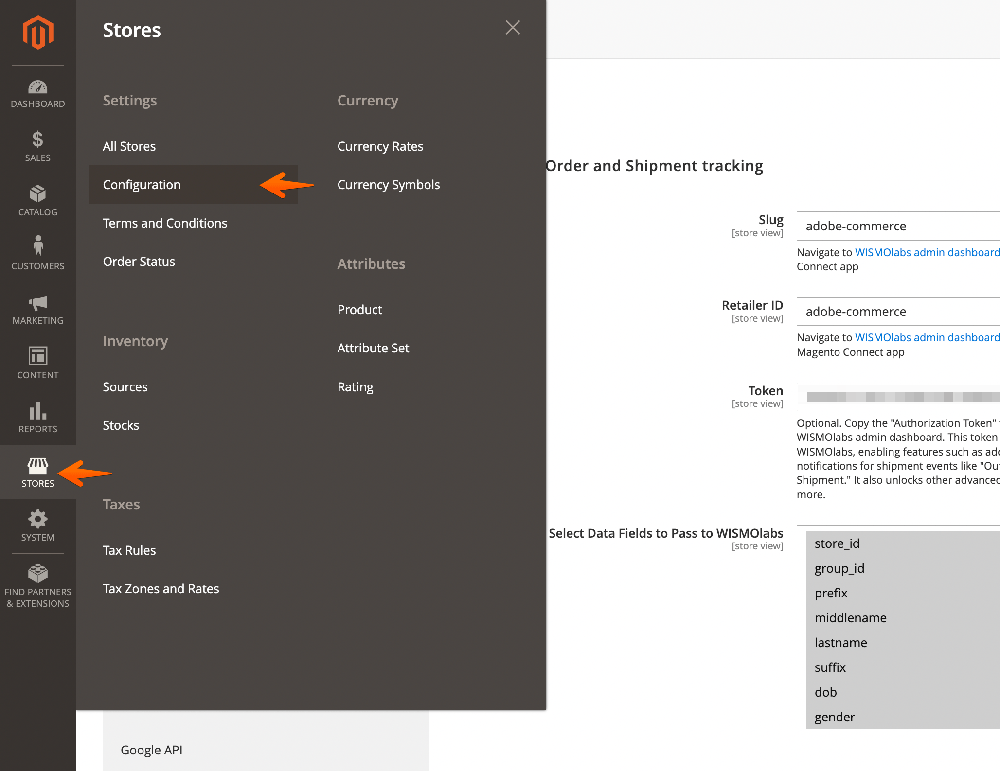
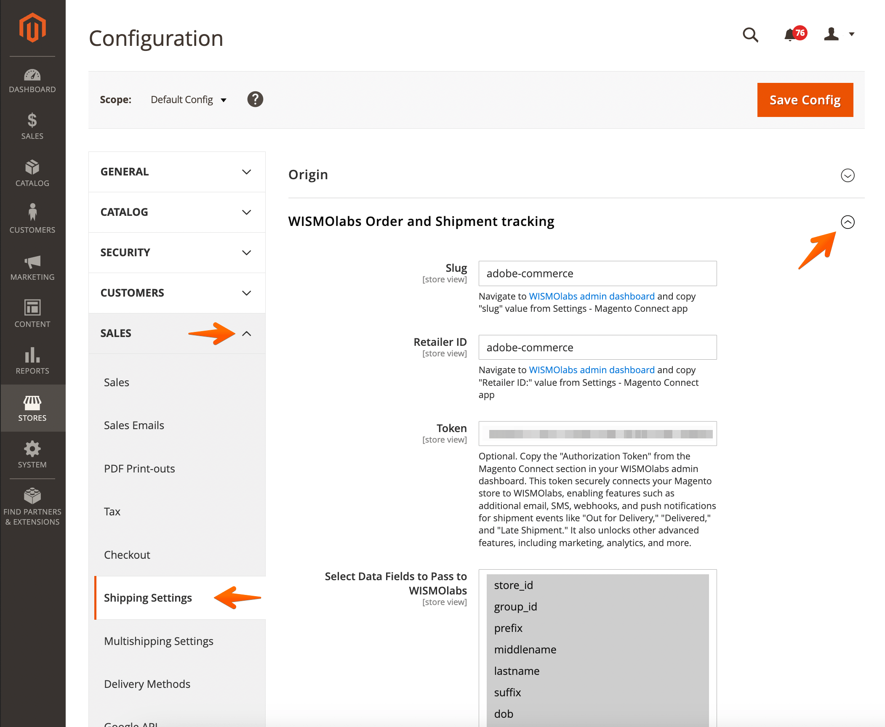
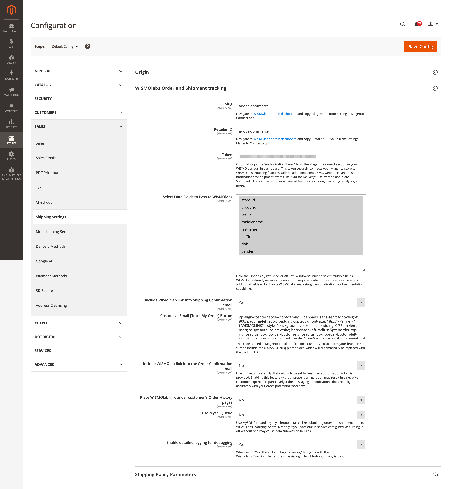

# WISMOlabs Magento 2 and Adobe Commerce Extension

The [WISMOlabs Order Status & Shipping Tracking Suite for Magento](https://wismolabs.com/integrations/magento/?utm_source=github&utm_medium=magento&utm_campaign=extension) connects Magento 2 and Adobe Commerce stores to the WISMOlabs post-purchase platform.

WISMOlabs provides shipment tracking, branded tracking pages, adaptable shipment notifications, delivery analytics, and post-purchase customer experiences across more than 750 carriers, 3PLs, and delivery providers.

## Decisioning Before Messaging

WISMOlabs does not simply convert carrier events into notifications. The platform combines Magento order, shipment, customer, store, and product data with carrier, 3PL and customer signals to evaluate the complete delivery situation.

It then determines whether action is needed and which response is appropriate. Once that decision is made, Liquid-powered templates dynamically adapt the selected action to the customer, order, shipment, carrier, and applicable business rules.

This gives retailers two levels of control:

1. Decision policies determine what should happen.
2. Adaptable action templates determine precisely how the selected response is delivered.

Retailers can create sophisticated post-purchase logic without building a difficult-to-maintain collection of disconnected notification flows.

WISMOlabs customers typically reduce "Where Is My Order?" inquiries by 70-90%. Results vary based on shipment profile, the existing customer experience, and implementation.

## Platform Capabilities

- Real-time shipment tracking across more than 750 carriers, 3PLs, and delivery providers
- Branded order and shipment tracking pages
- Multi-shipment views for orders fulfilled in separate packages
- Context-aware decisions for fulfillment, in-transit, out-for-delivery, delivered, delayed, customs, failed-delivery, and other situations
- Adaptable email, SMS, push, webhook, and third-party actions
- Liquid-powered templates for customer, order, shipment, carrier, and business-rule logic
- Tracking links in Magento order and shipping confirmation emails
- Tracking access from the Magento customer account area
- Shipment, carrier-performance, fulfillment, customer-service-risk, and engagement analytics
- Post-purchase engagement, education, cross-sell, and upsell actions when appropriate

The extension is available through the [Adobe Commerce Marketplace](https://commercemarketplace.adobe.com/wismolabs-tracking.html).

## Account, Trial, and Pricing

The extension is free to install.

You can evaluate the integration without creating a WISMOlabs account by using the basic unbranded tracking experience. A WISMOlabs account is required to configure branded tracking pages, decision policies, notifications, analytics, and other platform capabilities.

WISMOlabs offers a free trial. Paid access includes the complete platform and uses volume-based pricing. Per-shipment rates generally range from $0.15 to $0.01 depending on shipment volume and commercial terms.

- [Review WISMOlabs pricing](https://wismolabs.com/pricing/?utm_source=github&utm_medium=magento&utm_campaign=extension)
- [Request a WISMOlabs account](https://wismolabs.com/request-account/?platform=Magento&utm_source=github&utm_medium=magento&utm_campaign=extension)

## Prerequisites

- A working Magento 2 or Adobe Commerce installation
- PHP 8.1 or later
- Magento 2.4.7 or later

## Installation

From the root directory of your Magento installation, run:

```bash
composer require wismolabs/tracking
bin/magento module:enable Wismolabs_Tracking
bin/magento setup:upgrade
```

Flush the Magento cache after installation:

```bash
bin/magento cache:flush
```

## Configuration

### Step 1: Open WISMOlabs Settings

From the Magento Admin dashboard:

1. Go to **Stores > Configuration**.
2. Locate **Shipping Settings** under **Sales**.
3. Expand **WISMOlabs Order and Shipment Tracking**.





### Step 2: Configure the Connection



If you are evaluating basic unbranded tracking without an account, you can leave the account-specific fields at their default values.

For full platform access, configure the following fields using the values found under **Settings > Magento Connect** in the WISMOlabs dashboard:

- **Slug:** Enter the Slug supplied in the WISMOlabs dashboard.
- **Retailer ID:** Enter the Retailer ID supplied in the WISMOlabs dashboard.
- **Authorization Token:** Enter the token supplied in the Magento Connect section. The token enables account-connected features such as notifications, webhooks, analytics, and advanced platform functionality.
- **Data Fields:** Select the Magento fields required for your configured customer experience and business rules. Use Ctrl on Windows or Cmd on macOS to select multiple fields.

Only transmit data required for the configured implementation and your applicable privacy requirements.

### Step 3: Configure Optional Tracking Features

- **Include WISMOlabs Link in Shipping Confirmation Email:** Adds a tracking link to Magento shipping confirmation emails.
- **Customize the Track My Order Button:** Modify the button's HTML or CSS and use `{{WISMOLINK}}` as the dynamic tracking-link placeholder.
- **Include WISMOlabs Link in Order Confirmation Email:** Adds a tracking link to Magento order confirmation emails when an active WISMOlabs account and Authorization Token are configured.
- **Add WISMOlabs Link to Customer Order History:** Adds tracking access to the customer's Magento account area.
- **Use MySQL Queue:** Enables asynchronous processing through MySQL.
- **Enable Detailed Logging:** Writes troubleshooting information to `var/log/debug.log` using the `Wismolabs_Tracking_Helper` prefix.

### Step 4: Save and Test

1. Click **Save Config**.
2. Flush the Magento cache.
3. Place or select a test order.
4. Confirm that order and shipment data reach WISMOlabs.
5. Verify the tracking link, tracking page, and any configured actions before enabling them for customers.

## Support and Documentation

- [WISMOlabs Help Center](https://help.wismolabs.com/)
- [Magento integration information](https://wismolabs.com/integrations/magento/)
- [Contact WISMOlabs](https://wismolabs.com/contact-us/)
- Email: [support@wismolabs.com](mailto:support@wismolabs.com)

## Uninstall

From the root directory of your Magento installation, run:

```bash
bin/magento module:disable Wismolabs_Tracking
composer remove wismolabs/tracking
bin/magento setup:upgrade
bin/magento cache:flush
```

## License

This extension is distributed under the MIT License.
